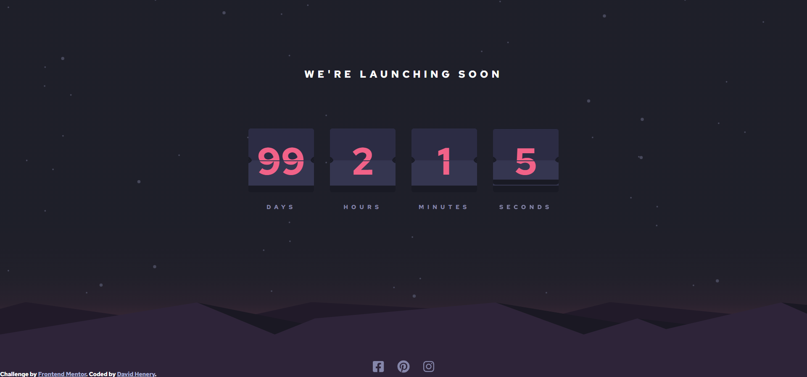

# Frontend Mentor - Launch countdown timer solution

This is a solution to the [Launch countdown timer challenge on Frontend Mentor](https://www.frontendmentor.io/challenges/launch-countdown-timer-N0XkGfyz-). Frontend Mentor challenges help you improve your coding skills by building realistic projects. 

## Table of contents

- [Overview](#overview)
  - [The challenge](#the-challenge)
  - [Screenshot](#screenshot)
  - [Links](#links)
- [My process](#my-process)
  - [Built with](#built-with)
  - [What I learned](#what-i-learned)
  - [Continued development](#continued-development)
  - [Useful resources](#useful-resources)
- [Author](#author)


## Overview

### The challenge

Users should be able to:

- See hover states for all interactive elements on the page
- See a live countdown timer that ticks down every second.
- **Bonus**: When a number changes, make the card flip from the middle.

### Screenshot



### Links

(LINKS TO BE ADDED!)
- Solution URL: [Add solution URL here](https://your-solution-url.com)
- Live Site URL: [Add live site URL here](https://your-live-site-url.com)

## My process

### Built with

- Semantic HTML5 markup
- CSS
- SASS/SCSS
- Flexbox
- CSS Grid
- Mobile-first workflow
- [React](https://reactjs.org/) - JS library
- React Hooks

### What I learned

My main takeaway from this project was how to build the fliping animation though CSS, rather than using a library.
This was a challenge for me because I've not really had to create this type of animation before but in the end (though a bit of reasearch and trial & error) I managed to create a decent flip animation. I done this by creating two top halfs of the card and two bottom halfs. One of the halfs maintained the number while fliping, while the over one does the fliping animation. The top half rotates to the middle of the card, while the bottom starts in the middle and then rotates to the end of the card. This creates the effect of one whole flip over the whole card.  

This are the classes I applied to the sections to create the animation.


```css
.flip-top {
  border-top: 1px solid $mostlyBlackVeryDarkBlue;
  animation: topflip 150ms ease-in;
  transform-origin: 50% 100%;
  perspective: 3000px;
  perspective-origin: top;
}

.flip-bottom {
  animation: bottomflip 150ms ease-out 150ms;
  transform: rotateX(90deg);
  transform-origin: top;
  perspective: 3000px;
  perspective-origin: center;
}

@keyframes topflip {
  100% {
    transform: rotateX(90deg);
  }
}

@keyframes bottomflip {
  100% {
    transform: rotateX(0deg);
  }
}
```

### Continued development

This challenge I feel has made me more comfortable with working out and creating different types of animations and will be excited to use them when needed in future projects. 

### Useful resources

- [Web Dev Simplified (Youtube-Video)
](https://www.youtube.com/watch?v=p_6IuhmBsfc) - I used this video for ideas on how to finish the animation, I felt like I completed about 90% of the whole animation on my own but needed to do a little research in order to finish it, and this video definitley helped give me ideas in order to finish implementing the animation and there are a lot of nuggets of knowledge that can be picked up here as well. 

- [LogRocket (blog post on fancy css corners)](https://blog.logrocket.com/how-to-create-fancy-corners-in-css) - Used this article to help give me the idea to create the "scooped" corners effect of the middle of the card. Its a good read and helps explain the different type of creative corner styles that can be implemented.

## Author

- Website - [David Henery](https://www.your-site.com)
- Frontend Mentor - [@David-Henery4](https://www.frontendmentor.io/profile/David-Henery4)
- LinkedIn - [David Henery](https://www.linkedin.com/in/david-henery-725458241)


